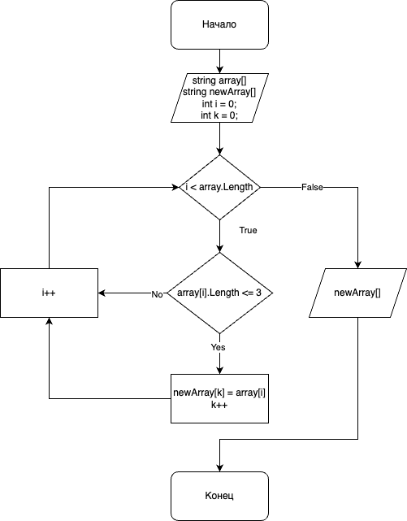

# Итоговая проверочная работа

> Будет тяжело, но у вас получится

#### Блок-схема работы

- Созданы массивы, заполнены информацией
- Создана функция CheckArray, принимает аргумент первого массива, записывает в новый массив информацию о элементах, в которых 3 или менее символов
- Создана функция PrintArr, которая принимает в аргумент новый массив и печатает на экран все элементы <=3 символов

[Кликни на меня, чтобы посмотреть код](https://github.com/marafon4k/final_gb_1st/blob/main/templates/Program.cs)